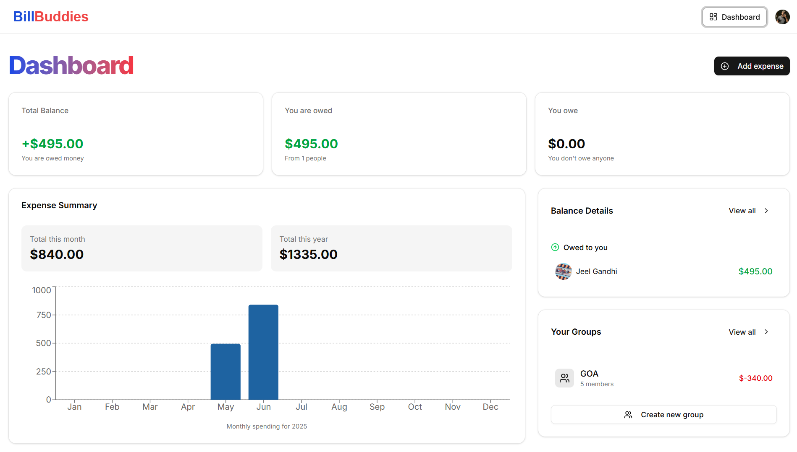
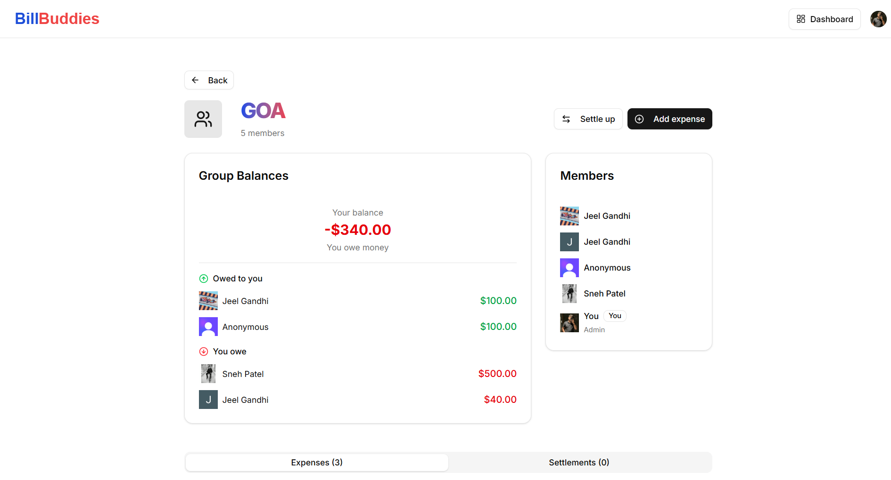
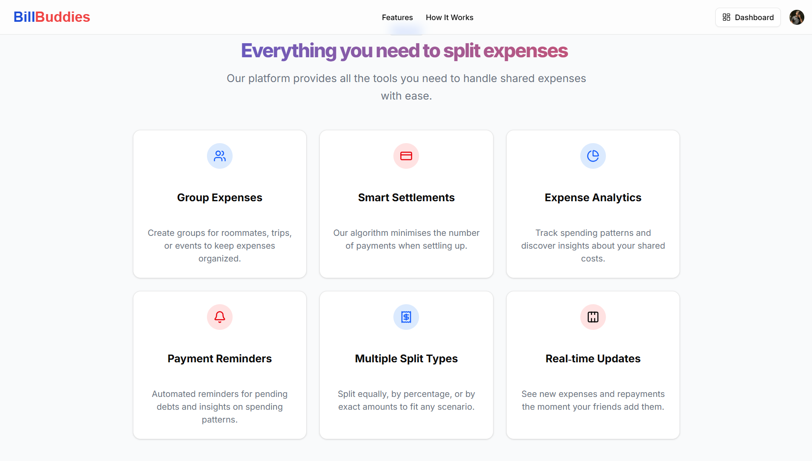

<!-- This is a [Next.js](https://nextjs.org) project bootstrapped with [`create-next-app`](https://github.com/vercel/next.js/tree/canary/packages/create-next-app).

## Getting Started

First, run the development server:

```bash
npm run dev
# or
yarn dev
# or
pnpm dev
# or
bun dev
```

Open [http://localhost:3000](http://localhost:3000) with your browser to see the results.

You can start editing the page by modifying `app/page.js`. The page auto-updates as you edit the file.

This project uses [`next/font`](https://nextjs.org/docs/app/building-your-application/optimizing/fonts) to automatically optimize and load [Geist](https://vercel.com/font), a new font family for Vercel.

## Learn More

To learn more about Next.js, take a look at the following resources:

- [Next.js Documentation](https://nextjs.org/docs) - learn about Next.js features and API.
- [Learn Next.js](https://nextjs.org/learn) - an interactive Next.js tutorial.

You can check out [the Next.js GitHub repository](https://github.com/vercel/next.js) - your feedback and contributions are welcome!

## Deploy on Vercel

The easiest way to deploy your Next.js app is to use the [Vercel Platform](https://vercel.com/new?utm_medium=default-template&filter=next.js&utm_source=create-next-app&utm_campaign=create-next-app-readme) from the creators of Next.js.

Check out our [Next.js deployment documentation](https://nextjs.org/docs/app/building-your-application/deploying) for more details. -->

# 💸 BillBuddies – AI-Powered Expense Management System

BillBuddies is a full-stack real-time Splitwise clone powered by AI. It simplifies personal and group expense tracking, provides smart insights, and minimizes debt—all wrapped in a sleek, responsive interface.


---

## 🚀 Features

- 🧠 **AI-Powered Insights** with [Gemini (Google AI)](https://deepmind.google/technologies/gemini/)
- 🔄 **Real-Time Expense Splitting** (equal, percentage, custom)
- 🧾 **Circular Debt Minimization** and Settlements
- 👥 **Group & Contact Management**
- 📬 **Automated Reminders** using Inngest + Resend
- 💬 **Expense Comments & History**
- ✅ **Form Validation** with Zod & React Hook Form
- 🎨 **Modern UI** built with Shadcn/UI and TailwindCSS

---

## 🛠️ Tech Stack

| Frontend              | Backend | AI / Automation    | Dev Experience          |
| --------------------- | ------- | ------------------ | ----------------------- |
| Next.js               | Convex  | Gemini (Google AI) | TypeScript              |
| React.js              | Inngest | Resend (Emails)    | TailwindCSS + Shadcn UI |
| React Hook Form + Zod |         |                    | Vercel (Hosting)        |

---

## 📸 Screenshots

> Replace these image paths with your actual image URLs or assets.

| Dashboard                      | Group View                 | Expense Summary              |
| ------------------------------ | -------------------------- | ---------------------------- |
|  |  |  |

---

## 🧠 How It Works

- Users can create groups or add contacts.
- Add expenses with smart split options (equal, percentage, custom).
- Circular debts are automatically minimized in the background.
- AI generates monthly insights (e.g., "You spent 40% more on food this month").
- Email reminders are triggered for pending debts.
- Everything updates **in real time** with Convex backend.

---

## 📦 Getting Started

### 1. Clone the Repository

```bash
git clone https://github.com/JEELGANDHI21/BillBuddies
cd billbuddies
```

### 2. Install Dependencies

```bash
npm install
# or
yarn install
```

### 3. Setup Environment Variables

```bash
Create a .env file in the root and add keys for:
CONVEX_DEPLOYMENT_URL=
GEMINI_API_KEY=
INNGEST_API_KEY=
RESEND_API_KEY=
```

### 4. Run the Development Server

```bash
npm run dev
```

📬 AI + Automation Setup
Gemini API: Generates monthly summaries and smart suggestions.

Inngest: Listens for scheduled events and triggers functions.

Resend: Sends transactional emails (e.g., payment reminders).

🤝 Contributing
Found a bug or have a feature idea?
Feel free to open an issue or submit a pull request. All contributions are welcome!
